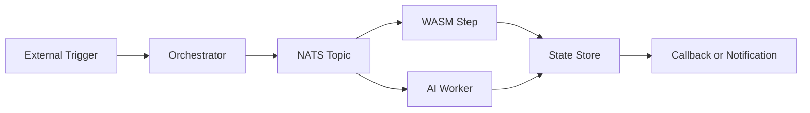
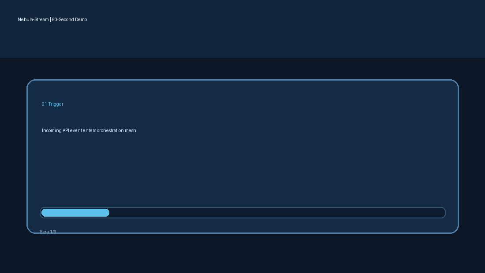

# Nebula-Stream

The High-Performance Edge-to-Cloud Distributed AI Orchestrator.

[](https://go.dev/)
[](https://github.com/erciktiburak/Nebula-Stream/actions/workflows/ci.yml)
[](https://github.com/erciktiburak/Nebula-Stream/actions/workflows/codeql.yml)
[](https://github.com/erciktiburak/Nebula-Stream/actions/workflows/scorecard.yml)
[](https://github.com/erciktiburak/Nebula-Stream/stargazers)
[](./LICENSE)
[](https://goreportcard.com/report/github.com/erciktiburak/Nebula-Stream)
[](https://securityscorecards.dev/viewer/?uri=github.com/erciktiburak/Nebula-Stream)
[](./CHANGELOG.md)

Nebula-Stream is an event-driven orchestration platform for microservices, AI workers, and serverless functions. It combines Go concurrency, NATS messaging, and WebAssembly sandboxing to execute workflow pipelines with low latency and strong isolation.

If this project helps you, consider giving it a star to support roadmap momentum.

## Why Nebula-Stream

- Build multi-step automations using one YAML workflow definition.
- Run untrusted plugin logic in WASM sandboxes (Rust and TinyGo targets).
- Route events across distributed worker nodes using NATS/JetStream patterns.
- Observe execution paths with OpenTelemetry-first design.
- Extend to visual flow editing and real-time operations dashboards.

## System Architecture

Nebula-Stream follows an event-driven control plane with distributed execution workers.


```text
Trigger/API -> Orchestrator Core (Go) -> NATS Event Bus -> Worker Mesh
                                                |              |
                                                |              +--> AI Workers (ONNX)
                                                |
                                                +--> WASM Runtime (Wasmtime)

Telemetry: OpenTelemetry traces + Prometheus metrics + Dashboard streams
```

Core components:

1. **Orchestrator Core (Go):** workflow scheduling, routing, state transitions.
2. **Event Bus (NATS/JetStream):** pub/sub transport, retries, dead-letter handling.
3. **WASM Runtime (Wasmtime):** secure plugin execution boundary.
4. **AI Workers:** model-specific processing nodes (ONNX-oriented).
5. **API Layer (gRPC):** external event triggers and control-plane surfaces.
6. **Web UI (Next.js + React Flow):** workflow authoring and node telemetry views.

## Project Layout

```text
Nebula-Stream/
  backend/
    engine/                # Orchestrator and runtime integration
    cli/                   # nebula-cli operational commands
  proto/nebula/v1/         # Internal gRPC and event schemas
  workflows/examples/      # Workflow YAML samples
  plugins/                 # WASM plugin examples and notes
  docs/                    # Architecture, benchmark, security notes
  deploy/                  # Local infrastructure definitions
  web/                     # Dashboard app surface
```

## Quick Start

Requirements:

- Go 1.24+
- Make
- Docker (for local NATS)

Bootstrap and validate:

```bash
make check
```

Run formatting or tests individually:

```bash
make fmt
make test
```

Start local messaging dependency:

```bash
docker compose -f deploy/docker-compose.yml up -d
```

Run entrypoints:

```bash
go run ./backend/engine/cmd/engine
go run ./backend/cli/cmd/nebula-cli
```

CLI command examples:

```bash
go run ./backend/cli/cmd/nebula-cli health --node edge-a1
go run ./backend/cli/cmd/nebula-cli deploy -f workflows/examples/hello-world.yaml --engine-url http://127.0.0.1:8080
go run ./backend/cli/cmd/nebula-cli trigger --workflow hello-world --topic workflow.hello-world.run --payload '{"message":"from-cli"}'
```

Control-plane API:

- `GET /healthz`
- `GET /api/v1/workflows`
- `GET /api/v1/workflows/active`
- `POST /api/v1/workflows/active` (JSON body)
- `POST /api/v1/workflows` (YAML body)
- `POST /api/v1/triggers` (JSON body)
- `GET /api/v1/executions/latest?workflow=<name>`
- `GET /api/v1/executions/history?workflow=<name>&limit=<n>`
- `GET /api/v1/executions/{eventID}`

End-to-end local event test:

```bash
docker compose -f deploy/docker-compose.yml up -d
go run ./backend/engine/cmd/engine
# in another terminal
go run ./backend/cli/cmd/nebula-cli deploy -f workflows/examples/hello-world.yaml --engine-url http://127.0.0.1:8080
go run ./backend/cli/cmd/nebula-cli trigger --topic workflow.hello --payload '{"message":"from-cli"}'
```

## Example Workflow

See `workflows/examples/hello-world.yaml` for a minimal trigger + step definition.

Execution flow example:



## Dashboard Demo

The dashboard demo now runs from `web/` with React Flow and mock live telemetry.

### 60-second product tour



In one minute, the demo shows the full path: trigger -> orchestrator -> NATS -> WASM/AI workers -> state callback -> live telemetry.

```bash
cd web
npm install
npm run dev
```

## Community

- Showcase thread: `https://github.com/erciktiburak/Nebula-Stream/discussions/1`
- Roadmap voting poll: `https://github.com/erciktiburak/Nebula-Stream/discussions/2`
- All discussions: `https://github.com/erciktiburak/Nebula-Stream/discussions`

Weekly maintainer cadence:

- Feature one community showcase every week.
- Convert top-voted roadmap requests into milestone issues.

## Performance Target

- Synthetic benchmark target: **50,000 events/second**.
- Details: `docs/benchmark.md`.

## Roadmap

The implementation was organized in three phases:

- Core architecture and messaging mesh
- Workflow engine and WASM runtime
- UI, telemetry, and production hardening

Commit-by-commit progress log: `docs/roadmap-progress.md`.

## Release

- Current milestone: **v1.0.0-beta - The First Constellation**
- Changelog: `CHANGELOG.md`

## Media Kit

- Architecture asset: `docs/media/architecture.svg`
- Dashboard placeholder: `docs/media/dashboard-placeholder.svg`
- Release note source: `docs/releases/v1.0.0-beta.md`

## License

MIT - see `LICENSE`.
